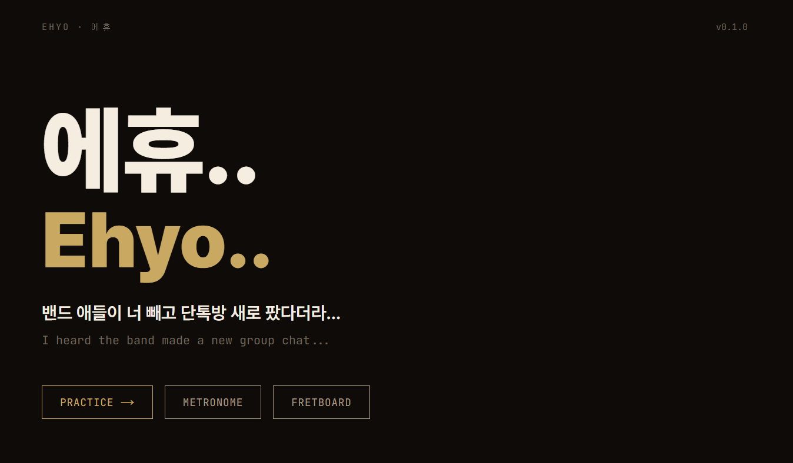
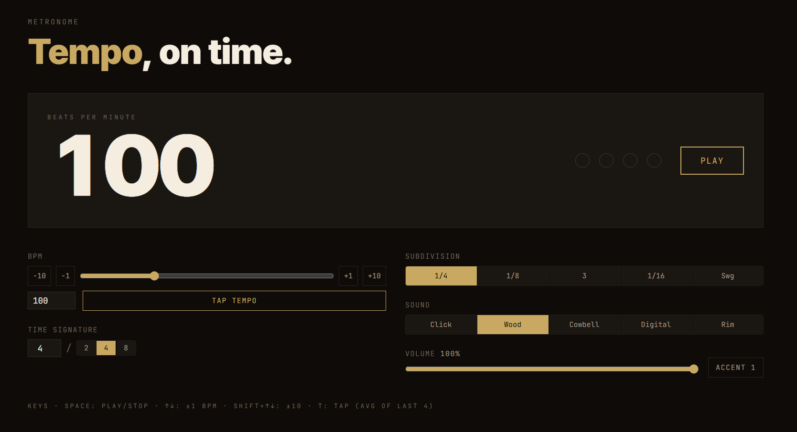
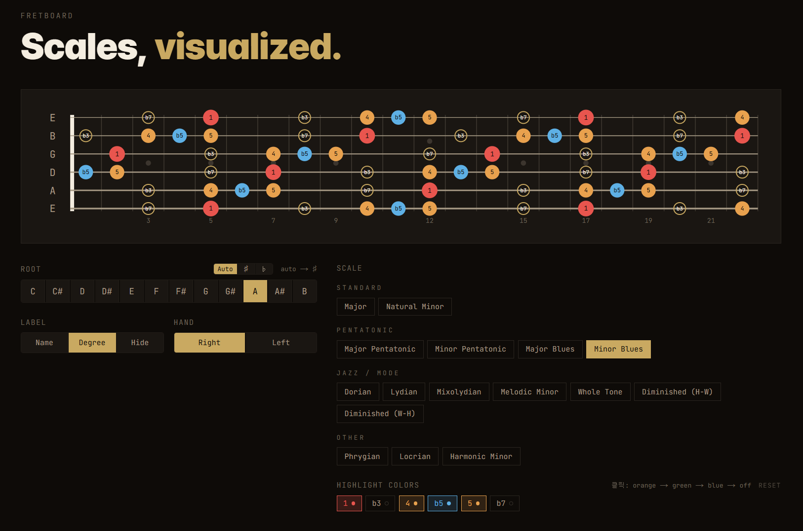
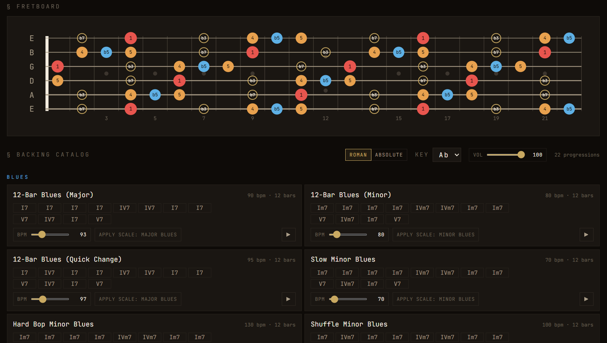

# 에휴.. (Ehyo..)

기타 연습자를 위한 웹 기반 **메트로놈 + 지판 스케일 가이드 + 배킹 트랙**.

브라우저 하나에서 박자 잡고, 지판에서 스케일 보면서, 코드 진행 위에 잼 칠 수 있는 단일 도구를 목표로 합니다. 모든 오디오는 클라이언트 측에서 합성 — 서버는 코드 진행 카탈로그만 제공합니다.

[](https://github.com/SingeonKim/gn-music-app/actions/workflows/ci.yml)
[](./LICENSE)
[](https://nextjs.org)
[](https://fastapi.tiangolo.com)



---

## 핵심 기능

### 메트로놈
Chris Wilson lookahead 스케줄러(25ms 콜백 / 100ms 룩어헤드, iOS 150ms)로 메인 스레드 드리프트 없이 정확한 박자.



### 지판 스케일 가이드
16종 스케일 × 12 키. Root / Important / Regular 3단계 노트 마커, 좌·우 손잡이 전환. Guitar 6/7현 + Bass 4현 멀티 instrument 지원.



### Practice 통합 뷰
sticky 지판 + 22장 코드 진행 카탈로그(blues / jazz / hard_bop / jump / minor / modal / folk / rock 등). 키·BPM·볼륨 컨트롤, Roman ↔ Absolute 표기 토글, 4-voice mute(drums/bass/guitar/aux).



배킹 트랙은 [smplr](https://github.com/danigb/smplr) 기반 SoundFont · DrumMachine · Reverb 합성 — 브라우저에서 직접 생성합니다. 카드별로 instrument · velocity · swing 정체성을 차등화해 같은 12-bar라도 jazz / shuffle / jump가 다른 질감을 가집니다.

---

## 기술 스택

| 레이어 | 스택 |
|---|---|
| 프론트엔드 | Next.js 15 (App Router), TypeScript, Tailwind CSS v4, Zustand (persist) |
| 오디오 | Web Audio API, smplr (Soundfont · DrumMachine · Reverb) |
| 백엔드 | FastAPI, SQLAlchemy 2.x (async), Alembic, Pydantic v2 |
| 인프라 | PostgreSQL, MinIO (S3 호환), Docker Compose, Railway |
| 테스트 | Vitest, Testing Library, Playwright, pytest |

런타임은 Node 20+, 패키지 매니저는 **pnpm 9**. 모노레포 워크스페이스(`apps/web`, `apps/api`)로 구성.

---

## 빠른 시작

### 프론트엔드만

```bash
pnpm install
pnpm dev          # http://localhost:3000
```

코드 진행 카탈로그는 빌드 시점에 `lib/api/generated.ts`로 번들되어 있어, 프론트만 띄워도 모든 기능이 동작합니다.

### 백엔드 포함 (카탈로그 편집 시)

```bash
docker compose up -d           # postgres:5432, api:8000, minio:9000/9001
docker compose ps              # healthy 상태 확인

cd apps/api
uv run alembic upgrade head    # 마이그레이션 적용
uv run python -m app.scripts.seed   # 카탈로그 시드 (idempotent)

# OpenAPI → 프론트 타입 갱신
pnpm --filter @my-music-app/web types:api
```

`lib/api/generated.ts`는 자동 생성 파일 — 직접 편집하지 마세요.

---

## 검증

커밋 전 다음을 통과해야 합니다 (CI에서도 동일하게 실행).

```bash
pnpm typecheck                 # tsc --noEmit, strict + noUncheckedIndexedAccess
pnpm lint                      # ESLint (next/core-web-vitals + next/typescript)
pnpm test                      # Vitest 단위 + 컴포넌트
pnpm test:coverage             # v8 커버리지 (lib/** 타겟)
```

E2E와 백엔드 테스트:

```bash
# Playwright — Docker 권장 (WSL 시스템 chromium 의존 회피)
docker compose -f docker-compose.test.yml up --exit-code-from playwright

# 백엔드
cd apps/api && uv run pytest
```

---

## 디렉토리 구조

```
apps/
  web/                    Next.js 프론트엔드 (@my-music-app/web)
    app/                  App Router. (practice) 라우트 그룹이 메트로놈·지판·jam 뷰 공유
    components/
      home/               랜딩 페이지 (RandomTaunt 페이드 사이클)
      metronome/          MetronomeDock, BpmInput, BeatLED
      fretboard/          SVG 지판 + 컨트롤
      jam/                Practice 통합 뷰 (코드 진행 카탈로그 등)
    lib/
      audio/              AudioContext 싱글턴 + Chris Wilson 스케줄러
        backing/          smplr 통합 (engine, voices, presets, fx-chain, card-profiles)
      theory/             음악 이론 순수 함수 (scales, notes, chords, fretboard)
      store/              Zustand + persist (localStorage 키: my-music-app:v1)
      api/                백엔드 카탈로그 클라이언트
  api/                    FastAPI 백엔드
    app/
      models/             SQLAlchemy 모델 (progression_templates 등)
      routers/            FastAPI 라우터
      schemas/            Pydantic v2 스키마
      scripts/seed.py     카탈로그 시드
    alembic/              마이그레이션
tests/
  unit/                   Vitest 순수 함수 (커버리지 100% 목표)
  component/              Testing Library
  e2e/                    Playwright (Docker 환경)
docs/
  planning.md             상세 기획·로드맵
.claude/agents/           도메인 에이전트 7명 (CLAUDE.md 참조)
```

---

## 핵심 설계 결정

코드만 봐서는 안 보이는 것들 — 변경 전 반드시 인지.

- **단일 AudioContext 원칙**: 앱 전체에서 인스턴스 1개. `lib/audio/context.ts` 싱글턴에서만 생성. 다른 곳에서 `new AudioContext()` 금지.
- **백엔드 책임 = 카탈로그 한정**: 사용자 상태(BPM, 키, 볼륨 등)는 모두 Zustand `persist` → `localStorage`. 인증·프리셋 공유는 Phase 5+.
- **음악 이론 레이어는 순수 함수**: `lib/theory/*` 커버리지 100% 목표. 수정은 `music-theory-guardian` 에이전트 게이트 필수.
- **fretboard.root는 키의 단일 소스**: 지판 root와 배킹 트랙 키가 항상 동일. v9 마이그레이션에서 `backing.backingKey`를 흡수했습니다.
- **reactStrictMode: false**: AudioContext 싱글턴 보호를 위해 의도적으로 꺼둠.
- **절대 볼륨 통일**: 카드 프로필의 `velocityScale`/`voiceGain` override 금지. 카드 정체성은 `reverbWet` + `instrumentOverrides` + 패턴(swing/triplet8/마디 변주)으로만 표현.
- **master volume slider 라우팅**: smplr instance → `fxChain.input` → compressor → dry/wet+reverb → masterGain → ctx.destination. masterGain이 final stage라 slider가 진정한 master.

상세는 [`CLAUDE.md`](./CLAUDE.md) 및 [`docs/planning.md`](./docs/planning.md) 참조.

---

## Phase 로드맵

- [x] **Phase 0** — 셋업
- [x] **Phase 1** — 메트로놈 MVP
- [x] **Phase 2** — 지판 스케일 가이드
- [x] **Phase 3** — 스케일 확장 (16종)
- [x] **Phase 4** — `/jam` (Practice) 통합 뷰
  - WebAudioFont → smplr 백엔드 마이그레이션, Master FX 체인, 9 카테고리 도메인 RhythmPattern
  - swing/triplet8 그루브 + 카드 프로필 시스템
  - 22장 카드별 instrument · tone · 패턴 정체성 차등화
- [ ] **Phase 5+** — 사용자 인증·프리셋 공유 (user 테이블 + JWT)

---

## 트러블슈팅

자주 마주치는 함정:

- **`.next` 캐시 오염** → `rm -rf .next && pnpm dev`
- **localStorage 스키마 변경 후 화면 깨짐** → `localStorage.removeItem('my-music-app:v1')` 후 새로고침
- **Playwright `libnspr4` 에러** → Docker 경로 사용 (`docker compose -f docker-compose.test.yml up`)
- **WSL Fast Refresh 미반응** → 이미 `WATCHPACK_POLLING=true` 적용됨, 안 되면 dev 재시작

세부 사례·해결책은 [`CLAUDE.md` 트러블슈팅 섹션](./CLAUDE.md#트러블슈팅-실제-겪은-것만)에 정리되어 있습니다.

---

## 기여

이 프로젝트는 개인 학습용으로 시작되어 외부 PR을 적극적으로 받지는 않습니다. 다만 다음은 환영합니다:

- **버그 리포트** — 특히 음악 이론 데이터 오류(스케일·도수·코드 진행) 또는 오디오 타이밍 이슈
- **Fork** — MIT 라이선스 안에서 자유롭게 변형하셔도 좋습니다
- **아이디어 공유** — 새로운 스케일·코드 진행·연습 패턴 제안

도메인 책임 구조와 커밋 규율은 [`CLAUDE.md`](./CLAUDE.md)에 자세히 적혀 있습니다.

> **Note for contributors** — 사용자 노출 앱 이름은 **에휴.. (Ehyo..)** 이지만 내부 식별자(npm 워크스페이스 `@my-music-app/web`, 디렉토리 `apps/web`, 패키지 imports)는 그대로 유지합니다. 빌드·임포트 경로 안정성을 위해 `My Music App` 내부 표기를 사용자 노출 카피로 옮기지 마세요.

---

## 라이선스

[MIT](./LICENSE) © 2026 Singeon Kim

배킹 트랙 합성에 사용된 [smplr](https://github.com/danigb/smplr) 및 SoundFont 샘플은 각자의 라이선스를 따릅니다.
